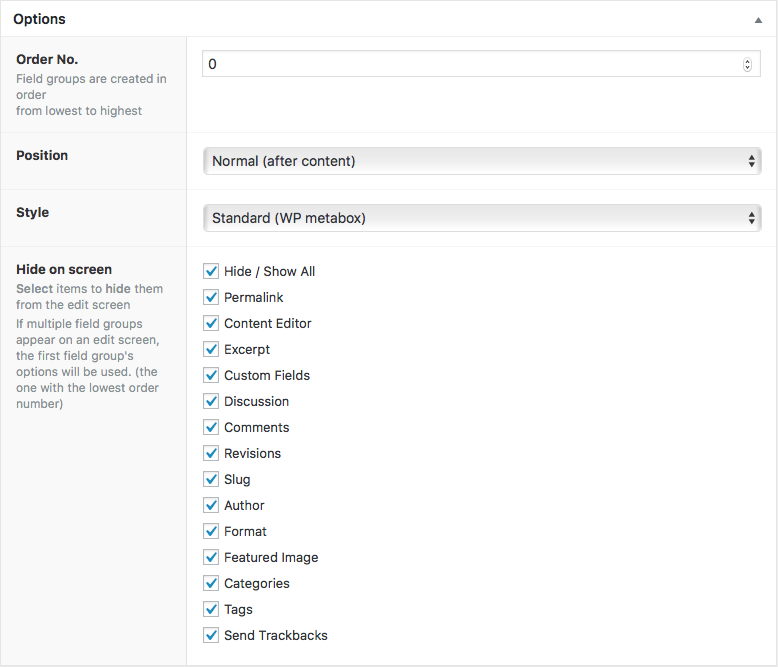

# Advanced Custom Fields

This plugin lets you add custom content boxes for your custom post types. 

It makes it easier for the user to enter data without worrying how it will be styled.

[TOC]

## Create a Field group

The idea behind the custom meta boxes is to group options and add an area for 

**Field groups** are used to organize fields and attach them to edit screens. Each field group contains a title, fields, location rules and visual settings

* Click on the `Custom Fields` menu item. 
* Click *Add New* to create a new Field Group
* Fill in a **Enter Title here** (Title is shown in the metabox handle on the edit screen). 
* Click *Add Field*

### Fields

A field is a value that you want the user to enter. For a car dealer, adding cars, that could be engine volume, Transmission type, Current Odometer value (used car) and color. 

When selecting Yes for Conditional Logic, you can tell if the field should show, based on previous filled out field. In this example number of gears should only show if I have previously selected Manual transmission.

The available ‘toggle’ fields are limited to only those which are of the type select, checkbox, true/false, radio.

### Locations 

The Locations setting is a conditional statement to decide if the custom fields should be available or not.

You can decide if they should be shown for all pages and posts and custom post types or just one specific. 

I will choose to only show these settings for the custom post type Cars and only for logged in administrators.

### Options

- You can set the order, if you have multiple Field groups.
- Set if you want the box below the title (high), below the content (Normal) or below the Side boxes.
- If you want a white box arounf the group choose Standard Style
- Even if you have Post features like the excerpt, authors etc activated via the Argument Supports in your custom post type configuration, you can hide them by default by selecting them via the Hide on screen.

## Functions to use in the loop

| Basic                                    |                                          |
| ---------------------------------------- | ---------------------------------------- |
| [get_field()](https://www.advancedcustomfields.com/resources/get_field/)`get_field($selector, [$post_id], [$format_value]);` | **Returns** the value of a specific field |
| [the_field()](https://www.advancedcustomfields.com/resources/the_field/)`the_field($selector, [$post_id], [$format_value]);` | **Displays** the value of a specific field |
